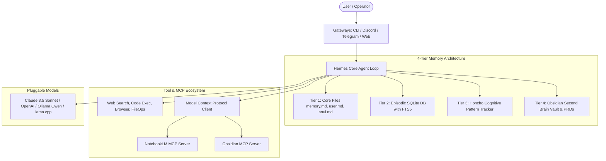

# HermesAG System Architecture

HermesAG is an open-source, multi-tier cognitive agent architecture engineered for 24/7 autonomous operations across local machines, VPS cloud nodes, and isolated Docker sandboxes.

